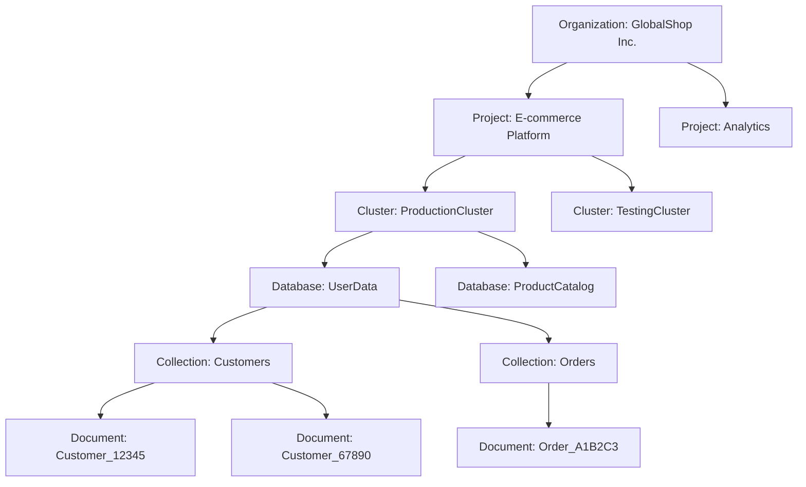

# MongoDB C# Developer Path Notes

- https://learn.mongodb.com/learn/learning-path/using-mongodb-with-c-sharp

## Outline 
- Unit 01: Getting Started with MongoDB Atlas, the Developer Data Platform
- Unit 02: Overview of MongoDB and the Document Model
- Unit 03: Connecting to a MongoDB Database
- Unit 04: MongoDB CRUD Operations: Insert and Find Documents
- Unit 05: MongoDB CRUD: Replace and Delete
- Unit 06: MongoDB CRUD Operations: Modifying Query Results
- Unit 07: MongoDB Aggregation
- Unit 08: MongoDB Indexing
- Unit 09: MongoDB Atlas Search
- Unit 10: Introduction to MongoDB Data Modeling
- Unit 11: MongoDB Transactions

## Unit 01: Getting Started with MongoDB Atlas, the Developer Data Platform
> Atlas 是MongoDB提供的全託管雲服務，它簡化了 MongoDB 叢集的部署和管理，並提供了一個用於監控和優化性能的直觀界面。
1. Set up an Altas account
2. Deploy an Atlas cluster
3. Use the Data Explorer

## Atlas Cluster
- Organizations
  - Group and define users and teams
  - Grant access to projects
- Project
  - Define and organize resources

## MongoDB Atlas 中各個層級的階層關係：

- 最頂層是 Organization（組織）
- 每個 Organization 可以包含多個 Project（項目）
- 每個 Project 可以有多個 Cluster（叢集）
- 每個 Cluster 可以包含多個 Database（數據庫）
- 每個 Database 可以有多個 Collection（集合）
- 每個 Collection 可以包含多個 Document（文檔）



### Project Setup
- https://account.mongodb.com/account/register


### Cluster Setup


### Go to Advanced Configuration
- Free Tier
- Cluster Tier: M0 Sandbox


### Add Admin User


### Set up Whitelist IP Address


### Load Sample Dataset


#### Load Successfully


### View, Edit, Modify, and Delete Data

- e.g. find sample_analytics.accounts where account_id = 371138

## Unit 02: Overview of MongoDB and the Document Model

- General Purpose Document Database
- Mongo DB Save Data As Flexible JSON-like Documents

### Document
- Easier to plan how application data will be stored in MongoDB
- Document is like instance of a class in OOP
- The basic unit of data in MongoDB
- Display like JSON, but stored in BSON (Binary JSON)

#### Structure of a Document
- The values in a document can be any data type, including strings, objects, arrays, booleans, nulls, dates, ObjectIds, and more.
- ObjectId is a datatype that creates uniquely identifiers for the required _id field
- _id field is a unique identifier for the document and is not a datatype

```bson
{
  "_id": ObjectId("5f8a7b2b9d3e2a1b3c4d5e6f"),
  "username": "john_doe",
  "email": "john.doe@example.com",
  "password": "hashed_password_here",
  "firstName": "John",
  "lastName": "Doe",
  "phoneNumber": "+886912345678",
  "address": {
    "street": "123 Main St",
    "city": "Taipei",
    "state": "Taiwan",
    "zipCode": "106"
  },
  "membershipLevel": "gold",
  "registrationDate": ISODate("2023-04-15T08:30:00Z"),
  "lastLogin": ISODate("2024-08-12T14:45:00Z"),
  "orderHistory": [
    {
      "orderId": ObjectId("5f8a7b2b9d3e2a1b3c4d5e70"),
      "date": ISODate("2024-07-20T10:15:00Z"),
      "totalAmount": 1500.00,
      "status": "delivered"
    }
  ],
  "wishlist": [
    ObjectId("5f8a7b2b9d3e2a1b3c4d5e71"),
    ObjectId("5f8a7b2b9d3e2a1b3c4d5e72")
  ],
  "preferences": {
    "newsletter": true,
    "smsNotifications": false
  }
}
```

```
{
  "_id": ObjectId("5f8a7b2b9d3e2a1b3c4d5e70"),
  "userId": ObjectId("5f8a7b2b9d3e2a1b3c4d5e6f"),
  "orderNumber": "ORD-20240720-001",
  "orderDate": ISODate("2024-07-20T10:15:00Z"),
  "status": "delivered",
  "totalAmount": 1500.00,
  "items": [
    {
      "productId": ObjectId("5f8a7b2b9d3e2a1b3c4d5e73"),
      "productName": "高效能筆記型電腦",
      "quantity": 1,
      "price": 1200.00
    },
    {
      "productId": ObjectId("5f8a7b2b9d3e2a1b3c4d5e74"),
      "productName": "無線滑鼠",
      "quantity": 2,
      "price": 150.00
    }
  ],
  "shippingAddress": {
    "street": "123 Main St",
    "city": "Taipei",
    "state": "Taiwan",
    "zipCode": "106"
  },
  "paymentMethod": "信用卡",
  "paymentDetails": {
    "cardType": "Visa",
    "last4Digits": "1234"
  },
  "shippingMethod": "標準配送",
  "shippingCost": 50.00,
  "discounts": [
    {
      "code": "SUMMER10",
      "amount": 50.00
    }
  ],
  "notes": "請在大門口放置包裹"
}
```

```
{
  "_id": ObjectId("5f8a7b2b9d3e2a1b3c4d5e75"),
  "userId": ObjectId("5f8a7b2b9d3e2a1b3c4d5e6f"),
  "items": [
    {
      "productId": ObjectId("5f8a7b2b9d3e2a1b3c4d5e71"),
      "productName": "智能手錶",
      "price": 299.99,
      "dateAdded": ISODate("2024-08-01T09:30:00Z")
    },
    {
      "productId": ObjectId("5f8a7b2b9d3e2a1b3c4d5e72"),
      "productName": "無線耳機",
      "price": 159.99,
      "dateAdded": ISODate("2024-08-05T14:20:00Z")
    }
  ],
  "lastUpdated": ISODate("2024-08-05T14:20:00Z"),
  "notificationSettings": {
    "priceDropAlert": true,
    "backInStockAlert": true
  }
}
```

### Collections
- A grouping of MongoDB documents
- The documents in a collection can have different structures and fields

### Database
- A container for collections

## Managing Databases, Collections, and Documents in Atlas Data Explorer

### Create a New Database and collection


### Add a New Collection in a existing Database


### Insert a New Document


## MongoDB Data Modeling
- Difference from relational database model and the document model

### How to model Data in MongoDB for your application
- What are the requirements of your application?
- What data will you be storing?
- How will users access the data?
- What data will be most valuable to your users?
- What are the relationships between the data?

### A good data model should
- easier to manage data
- make queries more efficient
- use less memory and cpu

### In MongoDB
- data that is accessed together should be stored together
- embedded documents enables us to build complex relationships between data
- normalization data by using database references
- store, query, and use resources efficiently

### 在MongoDB與關係型數據庫的差異：

| 特性 | MongoDB (NoSQL) | 關聯式資料庫 (RDBMS) |
|------|-----------------|----------------------|
| 資料模型 | 文件、集合和字段；可嵌套資料 | 表、行和列；規範化資料 |
| 模式 | 靈活，無固定模式 | 固定模式，需要預先定義 |
| 可擴展性 | 設計用於橫向擴展（分片） | 主要縱向擴展，橫向擴展較複雜 |
| 交易 | 支援ACID，通常限於單文件或單集合 | 完全支援ACID，可跨多表 |
| 查詢語言 | 類JSON語法，特定於MongoDB | SQL，較為標準化 |
| 資料關係 | 通過嵌入文件或引用實現 | 通過外鍵和連接實現 |
| 一致性 | 通常優化為最終一致性 | 強一致性 |
| 適用場景 | 非結構化數據、高擴展性需求、快速開發 | 結構化數據、複雜關係、強一致性需求 |
| 索引 | 支持多種類型索引 | 支持多種類型索引 |
| 模式變更 | 靈活，易於適應變化 | 通常需要複雜的遷移過程 |

這個表格概括了MongoDB（作為NoSQL資料庫的代表）和關聯式資料庫之間的主要差異。每種類型的資料庫都有其優勢和適用場景，選擇哪一種取決於具體的應用需求。

## Deal with Data Relationships in MongoDB
> Data that is accessed together should be stored together
> Structure data to match the way your application queries and updates data
### Types of Relationships

```text
{
    "_id": ObjectId("5f8a7b2b9d3e2a1b3c4d5e6f"), 
    "title": "Star Wars: A New Hope",
    "director": "George Lucas",
    "releaseYear": 1977,
    "casts": [
        {
            "actor": "Mark Hamill",
            "character": "Luke Skywalker"
        },
        {
            "actor": "Harrison Ford",
            "character": "Han Solo"
        }
    ]
}
```

#### 1 - 1
- title to director

#### 1 - N
- title to casts

#### N - N

### Ways to Model Relationships in MongoDB
- Embedding: take related data and store it in a single document
- Referencing: refer to documents in another collection

## Connecting with MongoDB Driver using .NET Core MVC
```
dotnet add package MongoDB.Driver
```

```
 <PackageReference Include="MongoDB.Driver" Version="2.28.0" />
```

### Ping MongoDB Atlas Cluster
```csharp

using MongoDB.Driver;
using MongoDB.Bson;

const string connectionUri = "mongodb+srv://<username>:<password>@mvcsample.rl3fd.mongodb.net/?retryWrites=true&w=majority&appName=MvcSample";

var settings = MongoClientSettings.FromConnectionString(connectionUri);

// Set the ServerApi field of the settings object to set the version of the Stable API on the client
settings.ServerApi = new ServerApi(ServerApiVersion.V1);

// Create a new client and connect to the server
var client = new MongoClient(settings);

// Send a ping to confirm a successful connection
try {
  var result = client.GetDatabase("admin").RunCommand<BsonDocument>(new BsonDocument("ping", 1));
  Console.WriteLine("Pinged your deployment. You successfully connected to MongoDB!");
} catch (Exception ex) {
  Console.WriteLine(ex);
}
```
