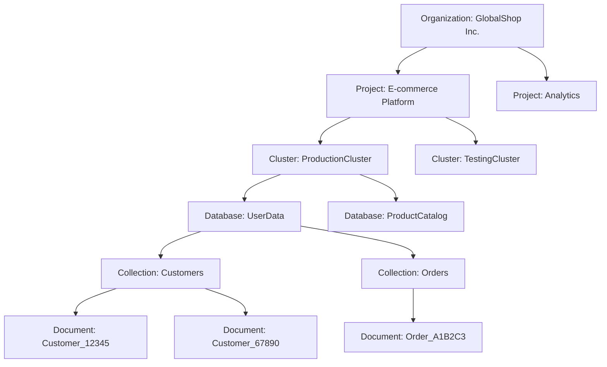

# MongoDB C# Developer Path Notes

- https://learn.mongodb.com/learn/learning-path/using-mongodb-with-c-sharp

## Outline

- Unit 01: Getting Started with MongoDB Atlas, the Developer Data Platform
- Unit 02: Overview of MongoDB and the Document Model
- Unit 03: Connecting to a MongoDB Database
- Unit 04: MongoDB CRUD Operations: Insert and Find Documents
- Unit 05: MongoDB CRUD: Replace and Delete
- Unit 06: MongoDB CRUD Operations: Modifying Query Results
- Unit 07: MongoDB Aggregation
- Unit 08: MongoDB Indexing
- Unit 09: MongoDB Atlas Search
- Unit 10: Introduction to MongoDB Data Modeling
- Unit 11: MongoDB Transactions

## Unit 01: Getting Started with MongoDB Atlas, the Developer Data Platform

> Atlas 是MongoDB提供的全託管雲服務，它簡化了 MongoDB 叢集的部署和管理，並提供了一個用於監控和優化性能的直觀界面。

1. Set up an Altas account
2. Deploy an Atlas cluster
3. Use the Data Explorer

### Atlas Cluster

- Organizations
    - Group and define users and teams
    - Grant access to projects
- Project
    - Define and organize resources

### MongoDB Atlas 中各個層級的階層關係：

- 最頂層是 Organization（組織）
- 每個 Organization 可以包含多個 Project（項目）
- 每個 Project 可以有多個 Cluster（叢集）
- 每個 Cluster 可以包含多個 Database（數據庫）
- 每個 Database 可以有多個 Collection（集合）
- 每個 Collection 可以包含多個 Document（文檔）



### Project Setup

- https://account.mongodb.com/account/register


### Cluster Setup


### Go to Advanced Configuration

- Free Tier
- Cluster Tier: M0 Sandbox
  

### Add Admin User


### Set up Whitelist IP Address


### Load Sample Dataset


#### Load Successfully


### View, Edit, Modify, and Delete Data

- e.g. find sample_analytics.accounts where account_id = 371138

## Unit 02: Overview of MongoDB and the Document Model

- General Purpose Document Database
- Mongo DB Save Data As Flexible JSON-like Documents

### Document

- Easier to plan how application data will be stored in MongoDB
- Document is like instance of a class in OOP
- The basic unit of data in MongoDB
- Display like JSON, but stored in BSON (Binary JSON)

#### Structure of a Document

- The values in a document can be any data type, including strings, objects, arrays, booleans, nulls, dates, ObjectIds,
  and more.
- ObjectId is a datatype that creates uniquely identifiers for the required _id field
- _id field is a unique identifier for the document and is not a datatype

```bson
{
  "_id": ObjectId("5f8a7b2b9d3e2a1b3c4d5e6f"),
  "username": "john_doe",
  "email": "john.doe@example.com",
  "password": "hashed_password_here",
  "firstName": "John",
  "lastName": "Doe",
  "phoneNumber": "+886912345678",
  "address": {
    "street": "123 Main St",
    "city": "Taipei",
    "state": "Taiwan",
    "zipCode": "106"
  },
  "membershipLevel": "gold",
  "registrationDate": ISODate("2023-04-15T08:30:00Z"),
  "lastLogin": ISODate("2024-08-12T14:45:00Z"),
  "orderHistory": [
    {
      "orderId": ObjectId("5f8a7b2b9d3e2a1b3c4d5e70"),
      "date": ISODate("2024-07-20T10:15:00Z"),
      "totalAmount": 1500.00,
      "status": "delivered"
    }
  ],
  "wishlist": [
    ObjectId("5f8a7b2b9d3e2a1b3c4d5e71"),
    ObjectId("5f8a7b2b9d3e2a1b3c4d5e72")
  ],
  "preferences": {
    "newsletter": true,
    "smsNotifications": false
  }
}
```

```
{
  "_id": ObjectId("5f8a7b2b9d3e2a1b3c4d5e70"),
  "userId": ObjectId("5f8a7b2b9d3e2a1b3c4d5e6f"),
  "orderNumber": "ORD-20240720-001",
  "orderDate": ISODate("2024-07-20T10:15:00Z"),
  "status": "delivered",
  "totalAmount": 1500.00,
  "items": [
    {
      "productId": ObjectId("5f8a7b2b9d3e2a1b3c4d5e73"),
      "productName": "高效能筆記型電腦",
      "quantity": 1,
      "price": 1200.00
    },
    {
      "productId": ObjectId("5f8a7b2b9d3e2a1b3c4d5e74"),
      "productName": "無線滑鼠",
      "quantity": 2,
      "price": 150.00
    }
  ],
  "shippingAddress": {
    "street": "123 Main St",
    "city": "Taipei",
    "state": "Taiwan",
    "zipCode": "106"
  },
  "paymentMethod": "信用卡",
  "paymentDetails": {
    "cardType": "Visa",
    "last4Digits": "1234"
  },
  "shippingMethod": "標準配送",
  "shippingCost": 50.00,
  "discounts": [
    {
      "code": "SUMMER10",
      "amount": 50.00
    }
  ],
  "notes": "請在大門口放置包裹"
}
```

```
{
  "_id": ObjectId("5f8a7b2b9d3e2a1b3c4d5e75"),
  "userId": ObjectId("5f8a7b2b9d3e2a1b3c4d5e6f"),
  "items": [
    {
      "productId": ObjectId("5f8a7b2b9d3e2a1b3c4d5e71"),
      "productName": "智能手錶",
      "price": 299.99,
      "dateAdded": ISODate("2024-08-01T09:30:00Z")
    },
    {
      "productId": ObjectId("5f8a7b2b9d3e2a1b3c4d5e72"),
      "productName": "無線耳機",
      "price": 159.99,
      "dateAdded": ISODate("2024-08-05T14:20:00Z")
    }
  ],
  "lastUpdated": ISODate("2024-08-05T14:20:00Z"),
  "notificationSettings": {
    "priceDropAlert": true,
    "backInStockAlert": true
  }
}
```

### Collections

- A grouping of MongoDB documents
- The documents in a collection can have different structures and fields

### Database

- A container for collections

## Managing Databases, Collections, and Documents in Atlas Data Explorer

### Create a New Database and collection


### Add a New Collection in a existing Database


### Insert a New Document


## MongoDB Data Modeling

- Difference from relational database model and the document model

### How to model Data in MongoDB for your application

- What are the requirements of your application?
- What data will you be storing?
- How will users access the data?
- What data will be most valuable to your users?
- What are the relationships between the data?

### A good data model should

- easier to manage data
- make queries more efficient
- use less memory and cpu

### In MongoDB

- data that is accessed together should be stored together
- embedded documents enables us to build complex relationships between data
- normalization data by using database references
- store, query, and use resources efficiently

### 在MongoDB與關係型數據庫的差異：

| 特性   | MongoDB (NoSQL)    | 關聯式資料庫 (RDBMS)    |
|------|--------------------|-------------------|
| 資料模型 | 文件、集合和字段；可嵌套資料     | 表、行和列；規範化資料       |
| 模式   | 靈活，無固定模式           | 固定模式，需要預先定義       |
| 可擴展性 | 設計用於橫向擴展（分片）       | 主要縱向擴展，橫向擴展較複雜    |
| 交易   | 支援ACID，通常限於單文件或單集合 | 完全支援ACID，可跨多表     |
| 查詢語言 | 類JSON語法，特定於MongoDB | SQL，較為標準化         |
| 資料關係 | 通過嵌入文件或引用實現        | 通過外鍵和連接實現         |
| 一致性  | 通常優化為最終一致性         | 強一致性              |
| 適用場景 | 非結構化數據、高擴展性需求、快速開發 | 結構化數據、複雜關係、強一致性需求 |
| 索引   | 支持多種類型索引           | 支持多種類型索引          |
| 模式變更 | 靈活，易於適應變化          | 通常需要複雜的遷移過程       |

這個表格概括了MongoDB（作為NoSQL資料庫的代表）和關聯式資料庫之間的主要差異。每種類型的資料庫都有其優勢和適用場景，選擇哪一種取決於具體的應用需求。

## Deal with Data Relationships in MongoDB

> Data that is accessed together should be stored together
> Structure data to match the way your application queries and updates data

### Types of Relationships

```text
{
    "_id": ObjectId("5f8a7b2b9d3e2a1b3c4d5e6f"), 
    "title": "Star Wars: A New Hope",
    "director": "George Lucas",
    "releaseYear": 1977,
    "casts": [
        {
            "actor": "Mark Hamill",
            "character": "Luke Skywalker"
        },
        {
            "actor": "Harrison Ford",
            "character": "Han Solo"
        }
    ]
}
```

#### 1 - 1

- title to director

#### 1 - N

- title to casts

#### N - N

### Ways to Model Relationships in MongoDB

#### Embedding: take related data and store it in a single document

```
{
  "_id": ObjectId("573a1390f29313caabcd413b"),
  "title": "Star Wars: Episode IV - A New Hope",
  "cast": [
    {"actor": "Mark Hamill", "character": "Luke Skywalker"},
    {"actor": "Harrison Ford", "character": "Han Solo"},
    {"actor": "Carrie Fisher", "character": "Princess Leia Organa"},
    ...
  ]
}
```

#### Referencing: refer to documents in another collection

```
{
  "_id": ObjectId("573a1390f29313caabcd413b"),
  "title": "Star Wars: Episode IV - A New Hope",
  "director": "George Lucas",
  "runtime": 121,
  "filming_locations": [
    ObjectId("654a1420f29313fgbcd718"),
    ObjectId("654a1420f29313fgbcd719"),
    ...
  ]
}
```

### Summary

- Data that is accessed together should be stored together
- Modeling 1 - 1, 1 - N, and N - N relationships is easy in MongoDB
- Two primary ways to model relationships in MongoDB: embedding and referencing

## Represent Relationships in MongoDB

1. Insert data into a document
2. Embed data in a document
3. Reference data in a document

### e.g. Modeling a Student Information Data

```json
{
  "student": "John Smith",
  "student_id": "001",
  "age": "18",
  "home_phone": "2125555000",
  "cell_phone": "2125555001",
  "email": "johnsmith@mongodb.edu",
  "grade_level": "freshman",
  "street": "3771 McClintock Ave",
  "city": "Los Angeles",
  "state": "CA",
  "zip": "90089",
  "emergency_contact_name": "Mary Smith",
  "emergency_contact_number": "2125555002",
  "emergency_contact_relation": "Mother",
  "courses": [
    {
      "course_id": "CS150",
      "course_name": "MongoDB101"
    },
    {
      "course_id": "CS177",
      "course_name": "Introduction to Programming in Python"
    }
  ]
}
```

- the information contains multiple phone numbers and courses

#### Embedding: Use an array to store multiple phone numbers

```json
{
  "student": "John Smith",
  "student_id": "001",
  "age": "18",
  "email": "johnsmith@mongodb.edu",
  "grade_level": "freshman",
  "street": "3771 McClintock Ave",
  "city": "Los Angeles",
  "state": "CA",
  "zip": "90089",
  "contact_number": [
    {
      "number": "2125555000",
      "type": "home"
    },
    {
      "number": "2125555001",
      "type": "cell"
    },
    {
      "number": "2125555002",
      "type": "emergency"
    }
  ]
  // ...
}
```

#### Referencing: Use referencing(course_id) to store courses

```json
{
  "courses": [
    {
      "course_id": "CS100",
      "course_name": "An Introduction to Computer Science",
      "professor": "Sarah Lambert",
      "Offered": "Spring, Summer, Fall, Winter"
    },
    {
      "course_id": "CS150",
      "course_name": "MongoDB101",
      "professor": "Bernie Hacker",
      "Offered": "Fall, Spring"
    },
    {
      "course_id": "CS177",
      "course_name": "Introduction to Programming in Python",
      "professor": "Bernie Hacker",
      "Offered": "Winter"
    }
  ]
}
```

## Embedding

- Embedding is used for one-to-one and one-to-many relationships
- Stored related data in a single document

### Pros

- Simplifies queries and updates
- Increases read performance
- Avoids the need for joins
- Allows developers to update related data in a single write operation

### Cons

- Embedding data into a single document can create large documents
- Large documents can impact read and write performance
- Continuously updating embedded data can lead to document growth
- Unbounded documents may exceed the BSON document size limit of 16MB

```json
{
  "name": {
    "firstName": "Sarah",
    "lastName": "Davis"
  },
  "job": "professor",
  "address": {
    "mailingAddress": {
      "street": "402 Maple",
      "city": "Chicago",
      "zipcode": "81442"
    },
    "secondaryAddress": {
      "street": "318 University Blvd",
      "city": "Chicago",
      "zipcode": "81445"
    },
    "emergencyAddress": {
      "name": "Kerri Davis",
      "street": "42 Wallaby Way",
      "city": "Sydney",
      "zipcode": "78 AU290",
      "country": "Australia"
    }
  }
}
```

## Referencing

- Save the _id field of one document in another document as a link between them
- Using reference is called linking, data normalization

### Pros

- No duplication of data
- Smaller documents

### Cons

- querying from multiple documents costs extra resources and impacts read performance

```
{
  "student": "John Smith",
  "student_id": "001",
  "age": "18",
  "email": "johnsmith@mongodb.edu",
  "grade_level": "freshman",
  "gpa": "4.0",
  "street": "3771 McClintock Ave",
  "city": "Los Angeles",
  "state": "CA",
  "zip": "90089",
  "emergency_contact_name": "Mary Smith",
  "emergency_contact_relation": "Mother",
  "courses": [
    {
      "course_id": "CS150",
      "course_name": "MongoDB101"
    },
    {
      "course_id": "CS177",
      "course_name": "Introduction to Programming in Python"
    }
  ]
}
```

## Comparison of Embedding and Referencing

| 特性          | 嵌入 (Embedding)         | 引用 (Referencing)      |
|-------------|------------------------|-----------------------|
| 單一查詢獲取資料    | ✅ 單一查詢獲取所有需要的數據        | ✅ 數據不會重複儲存            |
| 單一操作更新/刪除資料 | ✅ 更新或刪除資料時，只需操作一個文檔    | ✅ 文檔大小相對較小            |
| 數據重複        | ❗️ 可能會造成資料的重複儲存，增加數據冗餘 | ❗️ 獲取完整資料時，需從多個文檔聯結數據 |
| 文檔大小        | ❗️ 可能會導致文檔體積變大         |                       |

### 總結

選擇嵌入或引用依賴於具體場景的需求，考量數據的一致性、結構複雜性及性能需求。

## Scaling Data Model in MongoDB

### Optimum Efficiency

- query result time
- memory usage
- cpu usage
- storage

### Unbounded Growth

- unbounded documents are documents that grow indefinitely

```
{
  "title": "Basics of MongoDB",
  "url": "https://www.mongodbbasics.com",
  "text": "Let’s learn the basics of MongoDB!",
  "comments": [
    {
      "name": "John Smith",
      "created_on": ISODate("2022-07-21T11:00:00Z"),
      "comment": "I learned a lot!"
    },
    {
      "name": "Jane Doe",
      "created_on": ISODate("2022-07-22T11:00:00Z"),
      "comment": "Looks great!"
    }
  ]
}
```

> As the number of comments grows, the document size will increase, which can impact read and write performance.
> For this case, use referencing to store comments in a separate collection.

```
{
  "blog_entry_id": 1,
  "name": "John Smith",
  "created_on": ISODate("2022-07-21T11:00:00Z"),
  "comment": "I learned a lot!"
}
```

### Avoid

- the maximum document size limit of 16MB
- poor query performance
- poor write performance
- high memory usage

## Using Altas Tools for Schema Analysis

> Schema design patterns are guidelines for modeling data in MongoDB

### 常見的模式反模式

- 巨型數組 (Massive arrays): 使用過大的數組可能導致性能下降和操作複雜性增加。
- 大量集合 (Massive number of collections): 過多的集合可能會使數據管理變得困難，並影響查詢性能。
- 臃腫文檔 (Bloated documents): 文檔過大會導致存取速度變慢，並增加存儲需求。
- 不必要的索引 (Unnecessary indexes): 多餘的索引會佔用額外空間並影響寫入性能。
- 沒有索引的查詢 (Queries without indexes): 缺乏索引的查詢會使得資料檢索變得緩慢。
- 一起訪問的資料，但存儲在不同集合 (Data that’s accessed together, but stored in different collections):
  常常需要一起存取的數據卻分散在不同集合中，會增加查詢的複雜度。

## Connection Strings in MongoDB


### How to connect

- shell
- compass
- application

### Format

1. Standard format: connect to standalone cluster, replica set, or sharded cluster
2. DNS Seed List Connection Format: provide a DNS server list to connect to a replica set or sharded cluster
    - ability to change servers in rotation without reconfiguring client

### Standard Format

- prefix: `mongodb+srv://`
- credential: `username:password@`
- host: `hostname:port`
- options: `?retryWrites=true&w=majority&appName=MvcSample`

### Common Errors

- user network access error => add IP address to whitelist
- connection string error => check connection string format

## Connecting with MongoDB Driver using .NET Core MVC

- https://www.mongodb.com/docs/drivers/csharp/current/

### Install MongoDB Driver

```
dotnet add package MongoDB.Driver
```

```
 <PackageReference Include="MongoDB.Driver" Version="2.28.0" />
```

### Ping MongoDB Atlas Cluster

```csharp

using MongoDB.Driver;
using MongoDB.Bson;

const string connectionUri = "mongodb+srv://<username>:<password>@mvcsample.rl3fd.mongodb.net/?retryWrites=true&w=majority&appName=MvcSample";

var settings = MongoClientSettings.FromConnectionString(connectionUri);

// Set the ServerApi field of the settings object to set the version of the Stable API on the client
settings.ServerApi = new ServerApi(ServerApiVersion.V1);

// Create a new client and connect to the server
var client = new MongoClient(settings);

// Send a ping to confirm a successful connection
try {
  var result = client.GetDatabase("admin").RunCommand<BsonDocument>(new BsonDocument("ping", 1));
  Console.WriteLine("Pinged your deployment. You successfully connected to MongoDB!");
} catch (Exception ex) {
  Console.WriteLine(ex);
}
```

## Unit 03: Connecting to a MongoDB Database

### Install MongoDB Driver

```
dotnet add package MongoDB.Driver
```

```
 <PackageReference Include="MongoDB.Driver" Version="2.28.0" />
```

### Create a Connection


### Access a Database using .NET MongoDB Driver


### List all Databases

```csharp
using MongoDB.Driver;

var mongoUrl = new MongoUrl("mongodb+srv://<username>:<password>@mvcsample.rl3fd.mongodb.net/?retryWrites=true&w=majority&appName=MvcSample");
var client = new MongoClient(mongoUrl);
var dbList = client.ListDatabases().ToList();

foreach (var db in dbList)
{
    Console.WriteLine(db);
}

```

```text
{ "name" : "blog", "sizeOnDisk" : NumberLong(16384), "empty" : false }
{ "name" : "demo", "sizeOnDisk" : NumberLong(155648), "empty" : false }
{ "name" : "sample_airbnb", "sizeOnDisk" : NumberLong(55263232), "empty" : false }
{ "name" : "sample_analytics", "sizeOnDisk" : NumberLong(9408512), "empty" : false }
{ "name" : "sample_geospatial", "sizeOnDisk" : NumberLong(1343488), "empty" : false }
{ "name" : "sample_guides", "sizeOnDisk" : NumberLong(40960), "empty" : false }
{ "name" : "sample_mflix", "sizeOnDisk" : NumberLong(118382592), "empty" : false }
{ "name" : "sample_restaurants", "sizeOnDisk" : NumberLong(6803456), "empty" : false }
{ "name" : "sample_supplies", "sizeOnDisk" : NumberLong(1097728), "empty" : false }
{ "name" : "sample_training", "sizeOnDisk" : NumberLong(53182464), "empty" : false }
{ "name" : "sample_weatherdata", "sizeOnDisk" : NumberLong(2740224), "empty" : false }
{ "name" : "admin", "sizeOnDisk" : NumberLong(303104), "empty" : false }
{ "name" : "local", "sizeOnDisk" : NumberLong("22608318464"), "empty" : false }
```

### MongoClient

- An Application should use a single MongoClient instance to reused across all database requests
- Creating MongoClient is resource-intensive, so it is recommended to create a single instance and reuse it

## Insert Documents into MongoDB collection

- InsertOne
- InsertMany

> If the collection does not exist, MongoDB will create it when you insert the first document

### InsertOne: by mongo shell

```text
db.accounts.insertOne({
  "account_id": 111333,
  "limit": 12000,
  "products": [
    "Commodity",
    "Brokerage"
    ],
  "last_updated": new Date()
});
```


### InsertMany: by mongo shell

```text
db.accounts.insertMany([
  {
    "account_id": 111333,
    "limit": 12000,
    "products": [
    "Commodity",
    "Brokerage"
    ],
    "last_updated": new Date()
  },
  {
    "account_id": 678943,
    "limit": 8000,
    "products": [
    "CurrencyService",
    "Brokerage",
    "InvestmentStock"
    ],
    "last_updated": new Date()
  },
  {
    "account_id": 321654,
    "limit": 10000,
    "products": [
    "Commodity",
    "CurrencyService"
    ],
    "last_updated": new Date()
  }
]);
```


## Find Documents in MongoDB Collection

### command

- find
- it

### operators

- $in: select all documents that have a field equal to any value in the specified array
- $eq
- $lt: less than
- $gt: greater than
- $lte: less than or equal to
- $gte: greater than or equal to

### Find: by mongo shell

```text
db.zips.find();
```

- use `it` to display the next batch of documents

```text
it
```

### Find with Query: by mongo shell

```text
db.zips.find({ "state": "NY" });
```

```text
db.sales.find({ "_id": ObjectId("5bd761dcae323e45a93ccff4") });
```

### Find with Query and `$in` Operator: by mongo shell

```text
db.zips.find({ "state": { $in: ["NY", "CA"] } });
```

```text
db.sales.find({ storeLocation: { $in: ["London", "New York"] } });
```

### Find documents by using comparison operators

> find by nested property with dot notation


```text
{
    "_id": ObjectId("62d18e6ee46fce3f14998fcb"),
    "items": [
        {
            "name": "envelopes",
            "tags": ["stationary", "office", "general"],
            "price": Decimal128("22.9"),
            "quantity": 3
        }
    ],
    "customer": {
        "gender": "M",
        "age": 58,
        "email": "jalpo@ha.mq",
        "satisfaction": 5
    }
}
```

```text
db.sales.find({ "items.price" : { $gt : 50 }});
```

### Query Array Elements in MongoDB

```js
db.accounts.find({
    products: "Commodity"
});
```

> this query will return all documents where the products array contains the value "Commodity" and only the value "
> Commodity"


#### `$elemMatch`

- Use the $elemMatch operator to find all documents that contain the specified sub document.

> Querying Subdocuments

```js
db.accounts.find({
    products: {
        $elemMatch: {
            $eq: "Commodity"
        }
    }
});
```

```js
db.sales.find({
    items: {
        $elemMatch: {name: "laptop", price: {$gt: 800}, quantity: {$gte: 1}},
    },
})
```

```
{
  "<field>": {
    $elemMatch: {
      <query1>,
      <query2>,
      ...
    }
  }
}
```

#### Sample

```json
{
  "_id": 1,
  "name": "John",
  "scores": [
    {
      "subject": "math",
      "score": 90
    },
    {
      "subject": "english",
      "score": 85
    },
    {
      "subject": "history",
      "score": 80
    }
  ]
}
```

```js
db.students.find({
    scores: {
        $elemMatch: {score: {$gte: 80, $lte: 90}}
    }
})
```

### Finding Documents by Using Logical Operators

- `$and`, `$or`, `$not`, `$nor`

```
{
  "name": "Alice",
  "age": 25,
  "city": "New York",
  "job": "Engineer"
}
```

```js
db.collection.find({
    $and: [
        {age: {$gt: 20}},
        {city: "New York"}
    ]
})
```

```js
db.collection.find({
    $or: [
        {age: {$gt: 30}},
        {city: "Los Angeles"}
    ]
})
```

> when including the same operator more than once in your query, you need to use the explicit $and operator

```js
db.collection.find({
    $and: [
        {age: {$gt: 25}},
        {
            $or: [
                {city: "Chicago"},
                {job: "Teacher"}
            ]
        }
    ]
})
```

#### Sample

```
{
  _id: ObjectId('5bd761dcae323e45a93ccfe8'),
  saleDate: ISODate('2015-03-23T21:06:49.506Z'),
  items: [
    {
      name: 'printer paper',
      tags: [ 'office', 'stationary' ],
      price: Decimal128('40.01'),
      quantity: 2
    },
    {
      name: 'notepad',
      tags: [ 'office', 'writing', 'school' ],
      price: Decimal128('35.29'),
      quantity: 2
    },
    {
      name: 'pens',
      tags: [ 'writing', 'office', 'school', 'stationary' ],
      price: Decimal128('56.12'),
      quantity: 5
    },
    {
      name: 'backpack',
      tags: [ 'school', 'travel', 'kids' ],
      price: Decimal128('77.71'),
      quantity: 2
    },
    {
      name: 'notepad',
      tags: [ 'office', 'writing', 'school' ],
      price: Decimal128('18.47'),
      quantity: 2
    },
    {
      name: 'envelopes',
      tags: [ 'stationary', 'office', 'general' ],
      price: Decimal128('19.95'),
      quantity: 8
    },
    {
      name: 'envelopes',
      tags: [ 'stationary', 'office', 'general' ],
      price: Decimal128('8.08'),
      quantity: 3
    },
    {
      name: 'binder',
      tags: [ 'school', 'general', 'organization' ],
      price: Decimal128('14.16'),
      quantity: 3
    }
  ],
  storeLocation: 'Denver',
  customer: { gender: 'M', age: 42, email: 'cauho@witwuta.sv', satisfaction: 4 },
  couponUsed: true,
  purchaseMethod: 'Online'
}
```

> Find every document in the sales collection that meets the following criteria:

- Purchased online
- Used a coupon
- Purchased by a customer 25 years old or younger

```
db.sales.find({
  $and: [
    { purchaseMethod: "Online" },
    { couponUsed: true },
    { "customer.age": { $lte: 25 } }
  ]
})
```

> Return every document in the sales collection that meets one of the following criteria:

- Item with the name of pens
- Item with a writing tag

```js
db.sales.find({
  $or: [{ "items.name": "pens" }, { "items.tags": "writing" }],
})
```

```js
db.sales.find({
  items: {
    $elemMatch: {
      $or: [{ name: "pens" }, { tags: "writing" }]
    }
  }
})
```

